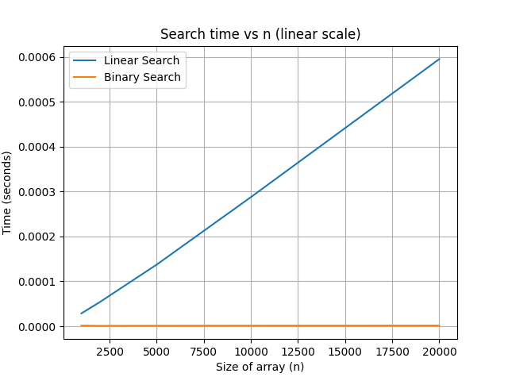
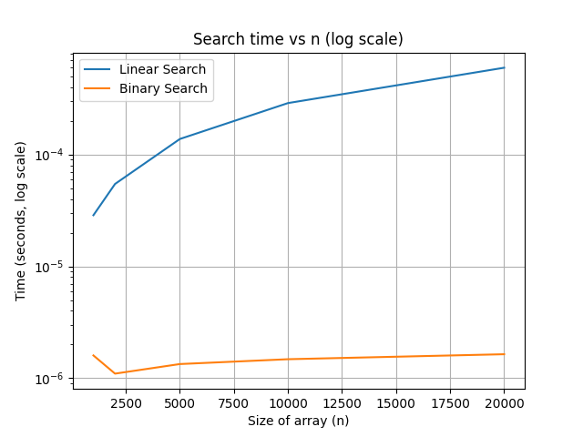

# Поиск: линейный и бинарный
## Системная информация
- Платформа: Windows-10-10.0.26100-SP0
- Python: 3.11.9
- Процессор: Intel64 Family 6 Model 158 Stepping 9, GenuineIntel
- Число логических ядер: 4
- Оперативная память: 16 GB DDR4
## Графики

## Вывод
В ходе лабораторной работы были реализованы и исследованы два алгоритма поиска: линейный поиск показал временную сложность О(n), бинарный поиск показал временную сложность O(log n). Практические эксперименты подтвердили теоретические оценки сложности.
