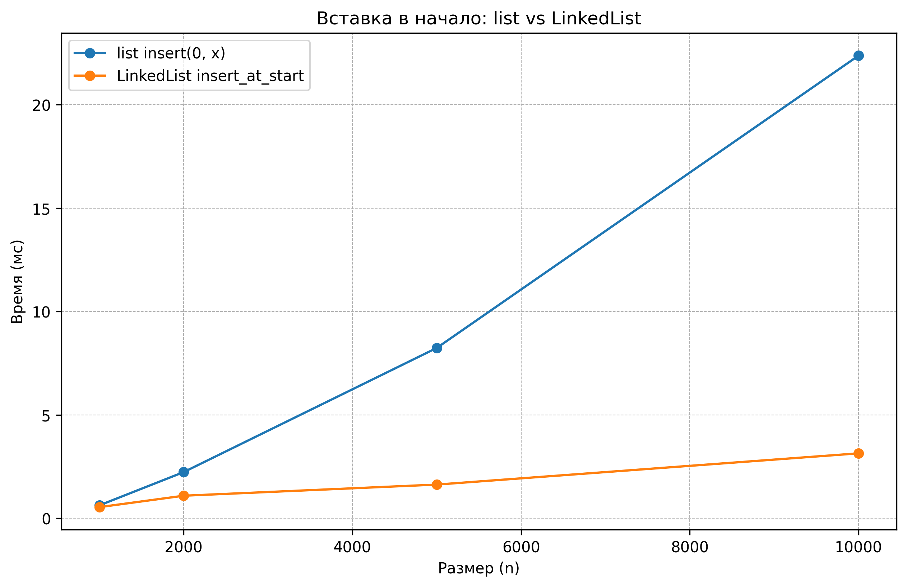
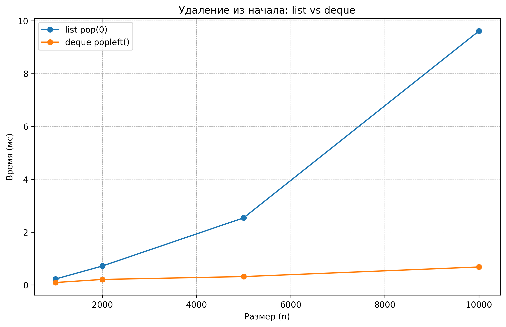

# Отчет по лабораторной работе 2
# Основные структуры данных. Анализ и применение

**Дата:** 2025-10-06
**Семестр:** 5 семестр
**Группа:** ПИЖ-б-о-23-1
**Дисциплина:** Анализ сложности алгоритмов
**Студент:** Петрищев Ярослав Дмитриевич

## Цель работы
Изучить понятие и особенности базовых абстрактных типов данных (стек, очередь, дек, связный список) и их реализаций в Python. Научиться выбирать оптимальную структуру данных для решения конкретной задачи, основываясь на анализе теоретической и практической сложности операций. Получить навыки измерения производительности и применения структур данных для решения практических задач.

## Теоретическая часть
Список (list) в Python: Реализация динамического массива. Обеспечивает амортизированное время O(1) для добавления в конец (append). Вставка и удаление в середину имеют сложность O(n) из-за сдвига элементов. Доступ по индексу - O(1). 
Связный список (Linked List): Абстрактная структура данных, состоящая из узлов, где каждый узел содержит данные и ссылку на следующий элемент. Вставка и удаление в известное место (например, начало списка) выполняются за O(1). Доступ по индексу и поиск - O(n).  
Стек (Stack): Абстрактный тип данных, работающий по принципу LIFO (Last-In-First-Out). Основные операции: push (добавление, O(1)), pop (удаление с вершины, O(1)), peek (просмотр вершины, O(1)). В Python может быть реализован на основе списка.
Очередь (Queue): Абстрактный тип данных, работающий по принципу FIFO (First-In-First-Out). Основные операции: enqueue (добавление в конец, O(1)), dequeue (удаление из начала, O(1)). В Python для эффективной реализации используется collections.deque.
Дек (Deque, двусторонняя очередь): Абстрактный тип данных, позволяющий добавлять и удалять элементы как в начало, так и в конец. Все основные операции - O(1). В Python реализован в классе collections.deque.

## Практическая часть

### Выполненные задачи
- Задача 1: Реализован класс `LinkedList` (Node, insert_at_start, insert_at_end с поддержкой tail, delete_from_start, traversal, len).
- Задача 2: Проведен сравнительный анализ производительности: `list.insert(0, x)` vs `LinkedList.insert_at_start`, `list.pop(0)` vs `deque.popleft()`.
- Задача 3: Решены практические задачи: проверка сбалансированности скобок (стек), симуляция очереди печати (deque), проверка палиндрома (deque).
- Задача 4: Построены графики по замерам времени (сохранены в `results/`).

### Пример работы программы
```bash
Задание 1:
True
False

Задание 2:
stats: {'processed_count': 4.0, 'avg_wait': 0.675, 'median_wait': 0.2500000000000001, 'avg_turnaround': 1.5250000000000001}
{'id': 'A', 'arrival': 0.0, 'start': 0.0, 'finish': 0.8, 'pages': 4, 'wait': 0.0, 'turnaround': 0.8}
{'id': 'B', 'arrival': 0.5, 'start': 0.8, 'finish': 1.2000000000000002, 'pages': 2, 'wait': 0.30000000000000004, 'turnaround': 0.7000000000000002}
{'id': 'C', 'arrival': 1.0, 'start': 1.2000000000000002, 'finish': 3.2, 'pages': 10, 'wait': 0.20000000000000018, 'turnaround': 2.2}
{'id': 'D', 'arrival': 1.0, 'start': 3.2, 'finish': 3.4000000000000004, 'pages': 1, 'wait': 2.2, 'turnaround': 2.4000000000000004}

Задание 3:
True
False
True
```

## Выводы
1. Для операций вставки/удаления в начале LinkedList эффективнее list (O(1) vs O(n)).
2. Для реализации очереди предпочтительнее collections.deque (popleft O(1)).
3. Эмпирические замеры подтвердили теоретические оценки по асимптотике.

## Ответы на контрольные вопросы
1. В чем ключевое отличие динамического массива (list в Python) от связного списка с точки зрения сложности операций вставки в начало и доступа по индексу? - Ключевое отличие: у динамического массива (list) элементы хранятся подряд в памяти, поэтому доступ по индексу - O(1), а вставка в начало требует сдвига всех существующих элементов вправо - O(n). У связного списка элементы представлены узлами со ссылками; вставка в начало меняет только одну ссылку - O(1), но доступ к элементу по индексу требует обхода от головы по ссылкам - O(n). Итого: вставка в начало - list: O(n), LinkedList: O(1); доступ по индексу - list: O(1), LinkedList: O(n).
2. Объясните принцип работы стека (LIFO) и очереди (FIFO). Приведите по два примера их практического использования. - Стек (LIFO - Last In, First Out): последний положенный элемент извлекается первым. Примеры: реализация undo/redo - каждое действие push, при отмене pop; вызовы функций/рекурсия - рамки вызова (call stack). Очередь (FIFO - First In, First Out): элементы обрабатываются в порядке поступления. Примеры: очередь задач на печать - задания обрабатываются в порядке отправки; обработка сообщений/запросов в сервере/очередь задач планировщика.
3. Почему операция удаления первого элемента из списка (list) в Python имеет сложность O(n), а из дека (deque) - O(1)? - Причина разницы в сложности: list в Python - подрядный массив; при удалении первого элемента необходимо сдвинуть все последующие элементы на одну позицию влево, чтобы сохранить плотное размещение - это O(n) копирований/перемещений элементов. deque (collections.deque) реализован как кольцевой буфер/набор блоков, оптимизированный для операций на концах: удаление/добавление с любого конца не требует сдвига всех элементов, выполняется манипуляцией указателей/индексов внутри буфера - O(1).
4. Какую структуру данных вы бы выбрали для реализации системы отмены действий (undo) в текстовом редакторе? Обоснуйте свой выбор. - Для реализации системы отмены действий (undo) я бы выбрал стек. Обоснование: поведение undo совпадает с принципом LIFO - последнее совершённое действие должно быть отменено первым. Технически: при выполнении операции её состояние/команда помещаются в стек (push); при Undo извлекается последний элемент (pop) и выполняется обратная операция. Для поддержки Redo обычно используется второй стек: при undo перемещаем элемент в стек redo; при redo - возвращаем обратно.
5. Замеры показали, что вставка 1000 элементов в начало списка заняла значительно больше времени, чем вставка в начало вашей реализации связного списка. Объясните результаты с точки зрения асимптотической сложности. - Если поэлементно вставлять n элементов в начало list, каждое i-е вставление (при уже имеющихся i элементов) требует сдвинуть i элементов - суммарная работа ≈ 0 + 1 + 2 + ... + (n−1) = n(n−1)/2 = O(n^2). Для n = 1000 это 1000·999/2 = 499500 перемещений элементов. У моей реализации связного списка каждое вставление в начало - O(1) (меняется одна ссылка и tail при первом вставлении), поэтому суммарно ≈ O(n) операций, то есть ~1000 простых изменений ссылок. Вот почему на практике вставка 1000 элементов в начало list занимает значительно больше времени: list выполняет сотни тысяч перемещений элементов, а linked list - тысячу простых операций. Дополнительно у list есть преимущества по локальности памяти (кэш), но это не компенсирует квадратичный рост количества операций при массовых вставках в начало.

## Приложения

### График 1: Вставка в начало


### График 2: Удаление из начала

