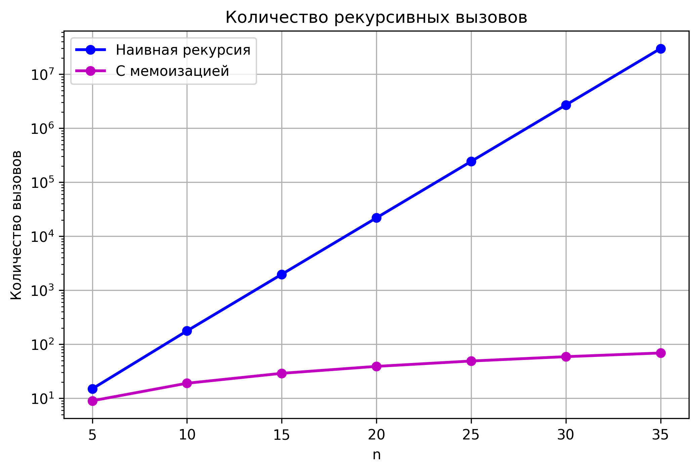

# Отчет по лабораторной работе №3
# Рекурсия

**Дата:** 2025-11-05  
**Семестр:** 5  
**Группа:** ПИЖ-б-о-23-1  
**Дисциплина:** Анализ сложности алгоритмов  
**Студент:** Петрищев Ярослав Дмитриевич  

## Цель работы
Освоить принцип рекурсии, научиться анализировать рекурсивные алгоритмы и понимать механизм работы стека вызовов. Изучить типичные задачи, решаемые рекурсивно, и освоить технику мемоизации для оптимизации рекурсивных алгоритмов. Получить практические навыки реализации и отладки рекурсивных функций.

## Теоретическая часть
Основные понятия рекурсии:
- Рекурсия - процесс, при котором функция вызывает саму себя для решения задачи
- Базовый случай - условие прекращения рекурсивных вызовов
- Рекурсивный шаг - разбиение задачи на подзадачи того же типа
- Глубина рекурсии - количество вложенных вызовов функции
- Мемоизация - техника оптимизации путем кеширования результатов вычислений

## Практическая часть
### Выполненные задачи
- Реализованы классические рекурсивные алгоритмы (факториал, Фибоначчи, быстрая степень)
- Реализована мемоизация для чисел Фибоначчи
- Решены практические задачи (бинарный поиск, обход файловой системы, Ханойские башни)
- Проведено сравнение производительности наивной и мемоизированной версий алгоритма Фибоначчи
- Построены графики времени выполнения и количества вызово

### Ключевые фрагменты кода
**Факториал**
```python
def factorial(n: int) -> int:
    if n < 0:
        raise ValueError('Факториала для отрицательных чисел не существует.')
    if n == 0:
        return 1
    return n * factorial(n - 1)
```
**Вычисление n-го числа Фибоначчи**
```python
def fibonacci(n: int, counter: Optional[list] = None) -> int:
    if counter is None:
        counter = [0]
    counter[0] += 1
    if n <= 1:
        return n
    return (fibonacci(n - 1, counter) + fibonacci(n - 2, counter))
```
**Мемоизация**
```python
def fibonacci_memo(n: int, counter: Optional[list] = None, memo: Optional[Dict[int, int]] = None,) -> int:
    if counter is None:
        counter = [0]
    counter[0] += 1
    if memo is None:
        memo = {}
    if n in memo:
        return memo[n]
    if n <= 1:
        return n
    memo[n] = (fibonacci_memo(n - 1, counter, memo) + fibonacci_memo(n - 2, counter, memo))
    return memo[n]
```

## Результаты выполнения
### Пример работы программы
```bash
=== Сравнение производительности ===
n=5: наивная=0.000000с (15 вызовов), мемоизация=0.000000с (9 вызовов)
n=10: наивная=0.000000с (177 вызовов), мемоизация=0.000000с (19 вызовов)
n=15: наивная=0.000000с (1,973 вызовов), мемоизация=0.000000с (29 вызовов)
n=20: наивная=0.003205с (21,891 вызовов), мемоизация=0.000000с (39 вызовов)
n=25: наивная=0.031479с (242,785 вызовов), мемоизация=0.000000с (49 вызовов)
n=30: наивная=0.339604с (2,692,537 вызовов), мемоизация=0.000000с (59 вызовов)
n=35: наивная=3.548807с (29,860,703 вызовов), мемоизация=0.000000с (69 вызовов)

=== Бинарный поиск ===
Массив: [1, 3, 5, 7, 9, 11, 13, 15]
Элемент 11 найден по индексу: 5

=== Обход файловой системы ===
DIR report/
  FILE fibonacci_calls_comparison.png
  FILE fibonacci_time_comparison.png
DIR src/
  FILE memoization.py
  FILE recursion.py
  FILE recursion_tasks.py
DIR venv/
  DIR Include/
  DIR Lib/
    DIR site-packages/
      FILE distutils-precedence.pth
      DIR pip/
      DIR pip-25.3.dist-info/
      DIR pkg_resources/
      DIR setuptools/
      DIR setuptools-65.5.0.dist-info/
      DIR _distutils_hack/
  FILE pyvenv.cfg
  DIR Scripts/
    FILE activate
    FILE activate.bat
    FILE Activate.ps1
    FILE deactivate.bat
    FILE pip.exe
    FILE pip3.11.exe
    FILE pip3.exe
    FILE python.exe
    FILE pythonw.exe

=== Ханойские башни ===
Решение для 4 дисков:
Переместить диск 1 с A на B
Переместить диск 2 с A на C
Переместить диск 1 с B на C
Переместить диск 3 с A на B
Переместить диск 1 с C на A
Переместить диск 2 с C на B
Переместить диск 1 с A на B
Переместить диск 4 с A на C
Переместить диск 1 с B на C
Переместить диск 2 с B на A
Переместить диск 1 с C на A
Переместить диск 3 с B на C
Переместить диск 1 с A на B
Переместить диск 2 с A на C
Переместить диск 1 с B на C
Всего ходов: 15

=== Измерение глубины рекурсии ===
Максимальная глубина рекурсии: 10
```

## Выводы
1. Рекурсия является мощным инструментом для решения задач, которые естественно разбиваются на подзадачи
2. Мемоизация позволяет значительно оптимизировать рекурсивные алгоритмы с перекрывающимися подзадачами
3. Экспоненциальная сложность наивной рекурсии делает ее непрактичной для больших значений n
4. Правильный выбор базового случая и рекурсивного шага критически важен для корректной работы рекурсивных функций

## Ответы на контрольные вопросы
1. Что такое базовый случай и рекурсивный шаг в рекурсивной функции? Почему отсутствие базового случая приводит к ошибке? - Базовый случай - условие прекращения рекурсии, рекурсивный шаг - вызов функции с упрощенной задачей. Отсутствие базового случая приводит к бесконечной рекурсии и переполнению стека.
2. Объясните, как работает механизм мемоизации. Как он меняет временную сложность вычисления чисел Фибоначчи по сравнению с наивной рекурсией? - Мемоизация сохраняет результаты вычислений в кеше. Для Фибоначчи это меняет сложность с O(2ⁿ) на O(n), так как каждое значение вычисляется только один раз.
3. В чем заключается основная проблема глубокой рекурсии и как она связана со стеком вызовов? - Глубокая рекурсия может привести к переполнению стека вызовов, так как каждый вызов сохраняет контекст в стеке. В Python ограничение обычно составляет около 1000 вызовов.
4. Задача о Ханойских башнях решается рекурсивно. Опишите алгоритм решения для 3 дисков. - Переместить 2 диска с A на B, переместить диск 3 с A на C, переместить 2 диска с B на C.
5. Рекурсивный и итеративный алгоритмы могут решать одни и те же задачи. Назовите преимущества и недостатки каждого подхода. - Рекурсивный подход обеспечивает лучшую читаемость и естественность для задач с древовидной структурой или математических определений, но имеет недостатки в виде накладных расходов на вызовы функций и риска переполнения стека. Итеративный подход более эффективен по памяти и производительности, проще в отладке и не имеет ограничений глубины, но часто приводит к более сложному и многословному коду. Выбор между подходами зависит от конкретной задачи: рекурсия предпочтительна для ясности кода при работе с рекурсивными структурами, а итерация - для критичных к производительности задач и обработки больших данных.

## Приложения
### Характеристики ПК
- Процессор: Intel Core i5-7500 3.40GHz
- Оперативная память: 16GB
- Операционная система: Windows 11 24H2
- Python: 3.11.9

### Графики
Сравнение количества вызовов


Сравнение времени выполнения

