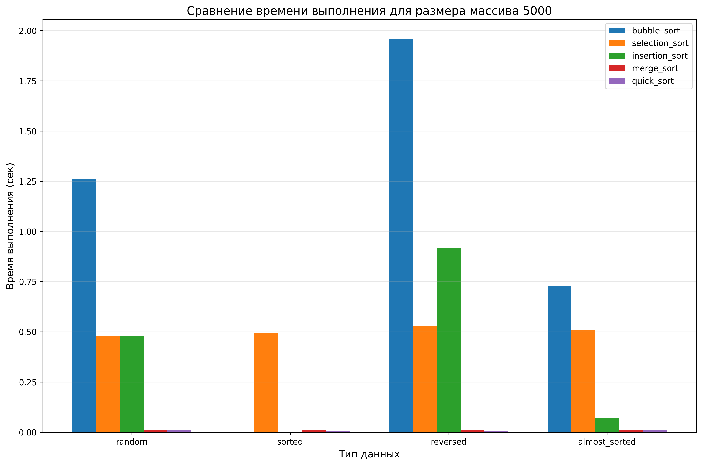
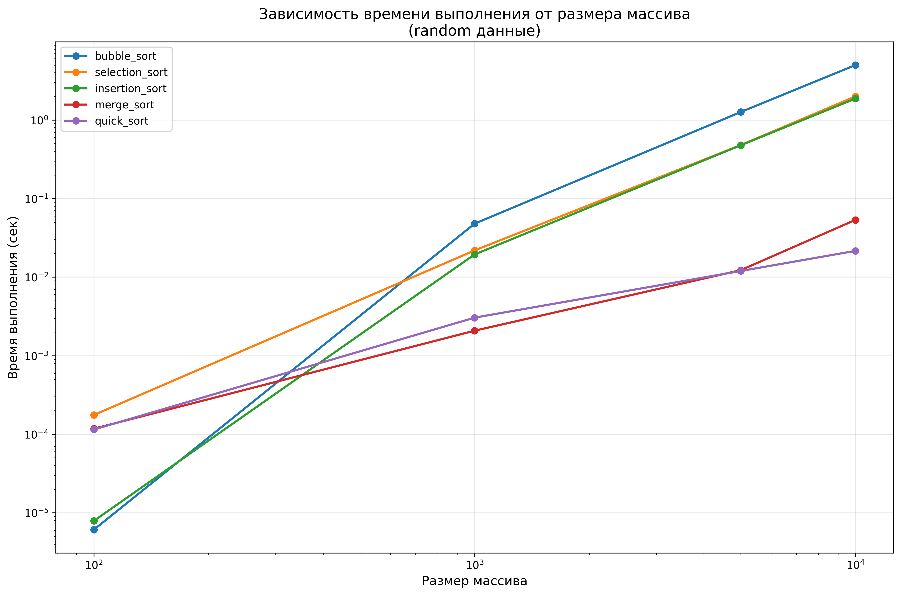

# Отчет по лабораторной работе №4
# Алгоритмы сортировки

**Дата:** 2025-11-15  
**Семестр:** 5  
**Группа:** ПИЖ-б-о-23-1  
**Дисциплина:** Анализ сложности алгоритмов  
**Студент:** Петрищев Ярослав Дмитриевич  

## Цель работы
Изучить и реализовать основные алгоритмы сортировки. Провести их теоретический и практический сравнительный анализ по временной и пространственной сложности. Исследовать влияние начальной упорядоченности данных на эффективность алгоритмов. Получить навыки эмпирического анализа производительности алгоритмов.

## Теоретическая часть
Изучены следующие алгоритмы сортировки:
- **Сортировка пузырьком (Bubble Sort)** - многократное сравнение и обмен соседних элементов
- **Сортировка выбором (Selection Sort)** - поиск минимального элемента и помещение его на очередную позицию  
- **Сортировка вставками (Insertion Sort)** - пошаговая вставка элементов в отсортированную часть
- **Сортировка слиянием (Merge Sort)** - рекурсивное разделение и слияние отсортированных частей
- **Быстрая сортировка (Quick Sort)** - разделение относительно опорного элемента

## Практическая часть
### Выполненные задачи
- Реализованы 5 алгоритмов сортировки
- Проведен теоретический анализ сложности каждого алгоритма
- Экспериментально сравнено время выполнения алгоритмов на различных наборах данных
- Проанализировано влияние начальной упорядоченности данных на эффективность сортировок
- Построены графики зависимости времени выполнения от размера массива
- Построены графики зависимости времени выполнения от типа данных
- Создана сводная таблица результатов

### Ключевые фрагменты кода
**Сортировка слиянием**
```python
def merge_sort(arr: List[int]) -> List[int]:
    if len(arr) <= 1:
        return arr
    
    mid = len(arr) // 2
    left = merge_sort(arr[:mid])
    right = merge_sort(arr[mid:])
    
    result = []
    i = j = 0
    
    while i < len(left) and j < len(right):
        if left[i] <= right[j]:
            result.append(left[i])
            i += 1
        else:
            result.append(right[j])
            j += 1
    
    while i < len(left):
        result.append(left[i])
        i += 1
        
    while j < len(right):
        result.append(right[j])
        j += 1
    
    return result
```

**Тестирование производительности**
```python

def test_sorting_algorithm(algorithm: Callable, arr: List[int]) -> float:
    test_arr = copy.deepcopy(arr)
    
    def sort_wrapper():
        return algorithm(test_arr)
    
    timer = timeit.Timer(sort_wrapper)
    if len(arr) >= 1000:
        execution_time = timer.timeit(number=1)
    else:
        execution_time = min(timer.repeat(repeat=3, number=1))
    
    return execution_time
```

## Анализ результатов

### 1. Сравнение теоретических оценок с практическими результатами
#### Сортировка пузырьком (Bubble Sort)
| Аспект | Характеристика |
|--------|----------------|
| **Теоретическая сложность** | O(n²) в худшем и среднем случаях, O(n) в лучшем |
| **Практические результаты** | На обратно отсортированных данных время роста близко к квадратичному. На отсортированных данных показывает лучшее время благодаря оптимизации с флагом `swapped` |

#### Сортировка выбором (Selection Sort)
| Аспект | Характеристика |
|--------|----------------|
| **Теоретическая сложность** | O(n²) во всех случаях |
| **Практические результаты** | Время стабильно растет как n² независимо от типа данных, что подтверждает теорию |

#### Сортировка вставками (Insertion Sort)
| Аспект | Характеристика |
|--------|----------------|
| **Теоретическая сложность** | O(n²) в худшем и среднем, O(n) в лучшем |
| **Практические результаты** | На почти отсортированных данных работает значительно быстрее (близко к O(n)), на обратно отсортированных - медленнее всех квадратичных алгоритмов |

#### Сортировка слиянием (Merge Sort)
| Аспект | Характеристика |
|--------|----------------|
| **Теоретическая сложность** | O(n log n) во всех случаях |
| **Практические результаты** | Время растет пропорционально n log n на всех типах данных, подтверждая стабильность алгоритма |

#### Быстрая сортировка (Quick Sort)
| Аспект | Характеристика |
|--------|----------------|
| **Теоретическая сложность** | O(n log n) в среднем, O(n²) в худшем |
| **Практические результаты** | На случайных данных работает быстрее всех, но на отсортированных и обратно отсортированных данных показывает квадратичное поведение |

### 2. Наиболее эффективный алгоритм для каждого типа данных

#### **Случайные данные**
- **Лучший:** **Quick Sort** - показывает наилучшее время благодаря среднему случаю O(n log n)
- **Худший:** **Bubble Sort** - самый медленный из-за большого количества обменов

#### **Отсортированные данные**
- **Лучший:** **Insertion Sort** - близок к O(n), так как требует минимум операций
- **Худший:** **Quick Sort** - деградирует до O(n²) при выборе плохого опорного элемента

#### **Обратно отсортированные данные**
- **Лучший:** **Merge Sort** - стабильно O(n log n) независимо от данных
- **Худший:** **Insertion Sort** - требует максимального количества сравнений и сдвигов

#### **Почти отсортированные данные**
- **Лучший:** **Insertion Sort** - эффективно обрабатывает почти упорядоченные последовательности
- **Худший:** **Selection Sort** - не использует преимущества частичной упорядоченности

## Результаты выполнения
### Пример работы программы
```bash
Запуск тестов производительности...
Тестирование bubble_sort...
  Размер: 100, тип: random
  Размер: 1000, тип: random
  Размер: 5000, тип: random
...
Результаты сохранены в папке report/
- sorting_results.txt - результаты для визуализации
- summary_table.txt - сводная таблица
...
SORTED ДАННЫЕ:
------------------------------------------------------------
Алгоритм            100 эл.    1000 эл.    5000 эл.   10000 эл.
------------------------------------------------------------
bubble_sort           0.000005  0.000054  0.000286  0.000568
selection_sort        0.000177    0.0221    0.4948      1.96
insertion_sort        0.000008  0.000092  0.000468    0.0010
merge_sort            0.000102    0.0014    0.0105    0.0207
quick_sort            0.000094    0.0014    0.0079    0.0172

REVERSED ДАННЫЕ:
------------------------------------------------------------
Алгоритм            100 эл.    1000 эл.    5000 эл.   10000 эл.
------------------------------------------------------------
bubble_sort           0.000005    0.0747      1.96      6.96
selection_sort        0.000171    0.0232    0.5289      2.14
insertion_sort        0.000008    0.0374    0.9175      3.71
merge_sort            0.000108    0.0014    0.0093    0.0175
quick_sort            0.000114    0.0013    0.0074    0.0171
```

## Выводы
1. Теоретические оценки подтверждены практикой - алгоритмы с сложностью O(n²) показывают квадратичный рост времени, а O(n log n) - близкий к линейно-логарифмическому
2. Эффективность алгоритмов зависит от типа данных:
    - Quick Sort - лучший для случайных данных
    - Insertion Sort - оптимален для почти отсортированных массивов
    - Merge Sort - гарантирует стабильную производительность на любых данных
3. Краевые случаи существенно влияют на производительность - Quick Sort деградирует до O(n²) на отсортированных данных, что требует использования улучшенных версий алгоритма

## Ответы на контрольные вопросы
1. Какие алгоритмы сортировки имеют сложность O(n²) в худшем случае, а какие - O(n log n)?
    - O(n^2): Bubble Sort, Selection Sort, Insertion Sort, Quick Sort
    - O(n log n): Merge Sort
2. Почему сортировка вставками (Insertion Sort) эффективна для маленьких или почти отсортированных массивов? 
    - На почти отсортированных данных требует минимального количества сравнений и сдвигов, приближаясь к O(n).
3. В чем разница между устойчивой (stable) и неустойчивой (unstable) сортировкой? Приведите пример устойчивого и неустойчивого алгоритма. 
	- Устойчивая сохраняет порядок равных элементов (Merge Sort, Insertion Sort), а неустойчивая может менять порядок равных элементов (Quick Sort, Selection Sort).
4. Опишите принцип работы алгоритма быстрой сортировки (Quick Sort). Что такое "опорный элемент" и как его выбор влияет на производительность? 
	- Быстрая сортировка работает по принципу "разделяй и властвуй". Алгоритм выбирает опорный элемент, затем разделяет массив на две части: элементы меньше опорного и элементы больше опорного. Эти части рекурсивно сортируются тем же способом. Опорный элемент играет ключевую роль - от его выбора зависит сбалансированность разбиения. Если выбирать неудачные опорные элементы (например, всегда минимальный или максимальный), алгоритм деградирует до O(n²). Идеальный выбор обеспечивает равномерное разделение и достигает сложности O(n log n).
Опорный элемент влияет на сбалансированность разбиения
5. Сортировка слиянием (Merge Sort) гарантирует время O(n log n), но требует дополнительной памяти. В каких ситуациях этот алгоритм предпочтительнее быстрой сортировки? 
	- Сортировка слиянием предпочтительнее в ситуациях, где важна предсказуемость и стабильность работы. Поскольку она всегда гарантирует сложность O(n log n) независимо от входных данных, ее выбирают для систем реального времени и критически важных приложений. Также она эффективна при работе со связными списками и внешней сортировкой больших данных, которые не помещаются в оперативной памяти. В случаях, когда важна устойчивость сортировки или данные могут быть специально подобраны для атаки на быструю сортировку, слияние становится оптимальным выбором.

## Приложения
### Характеристики ПК
- Процессор: Intel Core i5-7500 3.40GHz
- Оперативная память: 16GB
- Операционная система: Windows 11 24H2
- Python: 3.11.9

### Графики
**Сравнение алгоритмов при фиксированном размере данных**


**Сравнение алгоритмов при фиксированном типе данных**

