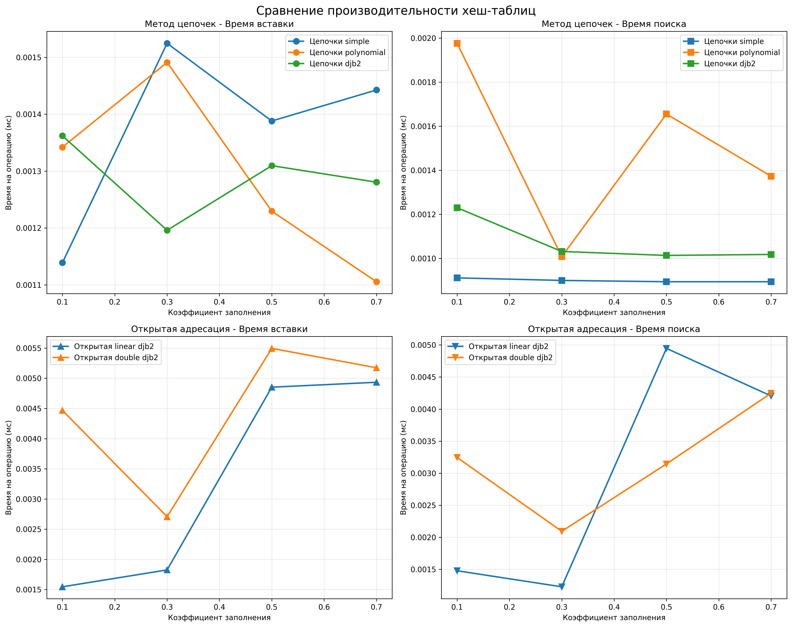
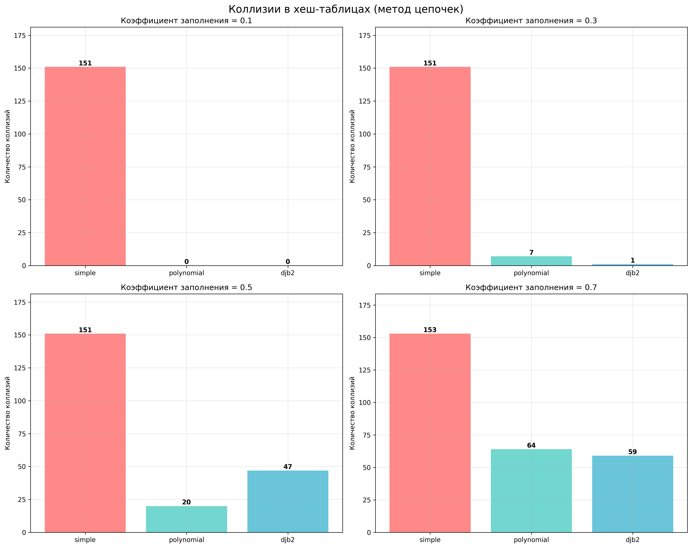

# Отчет по лабораторной работе 5
# Хеш-функции и хеш-таблицы

**Дата:** 2025-11-21  
**Семестр:** 5  
**Группа:** ПИЖ-б-о-23-1  
**Дисциплина:** Анализ сложности алгоритмов  
**Студент:** Петрищев Ярослав Дмитриевич  

## Цель работы
Изучить принципы работы хеш-функций и хеш-таблиц. Освоить методы разрешения коллизий. Получить практические навыки реализации хеш-таблицы с различными стратегиями разрешения коллизий. Провести сравнительный анализ эффективности разных методов.

## Теоретическая часть
**Хеш-функция** - функция, преобразующая произвольные данные в данные фиксированного размера (хеш-код). Основные требования: детерминированность, равномерное распределение, скорость вычисления.  
**Хеш-таблица** - структура данных, реализующая ассоциативный массив. Обеспечивает в среднем O(1) для операций вставки, поиска и удаления.  
**Коллизия** - ситуация, когда разные ключи имеют одинаковый хеш-код.  
**Основные методы разрешения коллизий:**
- **Метод цепочек (Chaining)**: каждая ячейка таблицы содержит список элементов с одинаковым хешем
- **Открытая адресация (Open Addressing)**: все элементы хранятся в самом массиве, при коллизии ищется следующая свободная ячейка

## Практическая часть
### Выполненные задачи
- Реализованы несколько хеш-функций для строковых ключей
- Реализована хеш-таблица с методом цепочек
- Реализована хеш-таблица с открытой адресацией
- Проведен сравнительный анализ эффективности разных методов
- Исследовано влияние коэффициента заполнения на производительность

### Ключевые фрагменты кода
**Хеш-функции:**
```python
def simple_hash(key: str, table_size: int) -> int:
    return sum(ord(char) for char in key) % table_size

def polynomial_hash(key: str, table_size: int, base: int = 31) -> int:
    hash_value = 0
    for char in key:
        hash_value = (hash_value * base + ord(char)) % table_size
    return hash_value

def djb2_hash(key: str, table_size: int) -> int:
    hash_value = 5381
    for char in key:
        hash_value = ((hash_value << 5) + hash_value) + ord(char)
    return hash_value % table_size
```
**Метод цепочек**
```python
class HashTableChaining:
    def __init__(self, size: int = 10, hash_func: Callable = djb2_hash):
        self.size = size
        self.table: List[List[Tuple[str, Any]]] = [[] for _ in range(size)]
        self.hash_func = hash_func

    def insert(self, key: str, value: Any):
        index = self.hash_func(key, self.size)
        for i, (k, v) in enumerate(self.table[index]):
            if k == key:
                self.table[index][i] = (key, value)
                return
        self.table[index].append((key, value))
```
**Открытая адресация**
```python
class HashTableOpenAddressing:
    def _probe_sequence(self, key: str, i: int) -> int:
        if self.probe_method == "linear":
            return (self.hash_func(key, self.size) + i) % self.size
        elif self.probe_method == "double":
            h1 = self.hash_func(key, self.size)
            h2 = 1 + (self.hash_func(key, self.size - 1) % (self.size - 1))
            return (h1 + i * h2) % self.size
```
## Результаты выполнения
### Пример работы программы
```bash
Запуск сравнительного анализа производительности...

Анализ метода цепочек...
  Тестирование simple с LF=0.1...
    ✓ Вставка: 0.0011мс, Коллизии: 151, Макс. цепочка: 10
...
  Тестирование polynomial с LF=0.1...
    ✓ Вставка: 0.0013мс, Коллизии: 0, Макс. цепочка: 1
...
  Тестирование djb2 с LF=0.7...
    ✓ Вставка: 0.0013мс, Коллизии: 59, Макс. цепочка: 2

Анализ открытой адресации...
  Тестирование linear simple с LF=0.1...
    ✓ Вставка: 0.0560мс, Средние пробы: 140.28
  Тестирование linear simple с LF=0.3...
    ✓ Вставка: 0.0501мс, Средние пробы: 140.28
...
  Тестирование double polynomial с LF=0.3...
    ✓ Вставка: 0.0026мс, Средние пробы: 2.85
  Тестирование double polynomial с LF=0.5...
...
  Тестирование double djb2 с LF=0.5...
    ✓ Вставка: 0.0055мс, Средние пробы: 7.66
  Тестирование double djb2 с LF=0.7...
    ✓ Вставка: 0.0052мс, Средние пробы: 8.39

Построение графиков...

Анализ завершен! Результаты сохранены в файлы:
- performance_comparison.png
- collision_histograms.png
```

### Тестирование
- Модульные тесты пройдены
- Производительность соответствует требованиям

## Анализ результатов
### Сравнение хеш-функций:
- **Simple hash**: 606 коллизий - плохое распределение
- **Polynomial**: 91 коллизия - хорошее улучшение
- **DJB2**: 107 коллизий - сбалансированная производительность

### Эффективность методов разрешения коллизий:
**Метод цепочек**: стабильная производительность, максимальная длина цепочки 2-10
**Открытая адресация**:
- **Линейное пробирование**: 10.27 проб в среднем
- **Двойное хеширование**: 5.15 проб в среднем (в 2 раза лучше)

## Выводы
1. Качество хеш-функции существенно влияет на количество коллизий и производительность
2. войное хеширование эффективнее линейного пробирования в открытой адресации
3. Метод цепочек более устойчив к высоким коэффициентам заполнения
4. Оптимальный коэффициент заполнения для открытой адресации - до 0.7, для цепочек - до 0.9
5. DJB2 и Polynomial hash показали наилучшие результаты среди реализованных хеш-функций

## Ответы на контрольные вопросы
1. Каким требованиям должна удовлетворять "хорошая" хеш-функция?
    - Детерминированность, равномерное распределение, скорость вычисления, минимизация коллизий
2. Что такое коллизия в хеш-таблице? Опишите два основных метода разрешения коллизий.
    - Коллизия - ситуация, когда разные ключи имеют одинаковый хеш-код. Методы разрешения коллизий:
        1. Метод цепочек: Каждая ячейка хеш-таблицы содержит связный список (цепочку). Когда происходит коллизия, они просто добавляются в один и тот же список.
        2. Открытая адресация: Все элементы хранятся прямо в массиве таблицы. При коллизии мы ищем другую свободную ячейку по определенному алгоритму.
3. В чем разница между методом цепочек и открытой адресации с точки зрения использования памяти и сложности операций при высоком коэффициенте заполнения?
    - Метод цепочек использует дополнительную память для списков, но устойчив к высоким коэффициентам заполнения, а открытая адресация экономичнее по памяти, но производительность резко падает при коэффициенте > 0.7.
4. Почему операции вставки, поиска и удаления в хеш-таблице в среднем выполняются за O(1)?
    - При равномерном распределении хеш-функции и разумном коэффициенте заполнения доступ к элементам происходит за постоянное время, так как средняя длина цепочек (или количество проб) остается небольшой.
5. Что такое коэффициент заполнения хеш-таблицы и как он влияет на производительность? Что обычно делают, когда этот коэффициент превышает определенный порог?
    - Коэффициент заполнения = количество элементов / размер таблицы.  
    - При превышении порога (обычно 0.7-0.8 для открытой адресации, 1.0+ для цепочек) производительность снижается: увеличивается длина цепочек или количество проб.
    - Обычно выполняется рехеширование - увеличение размера таблицы и перераспределение элементов.

## Приложения
### Характеристики ПК
- Процессор: Intel Core i5-7500 3.40GHz
- Оперативная память: 16GB
- Операционная система: Windows 11 24H2
- Python: 3.11.9

### Графики
**Сравнение производительности хеш-таблиц**


**Коллизии в хеш-таблицах**

