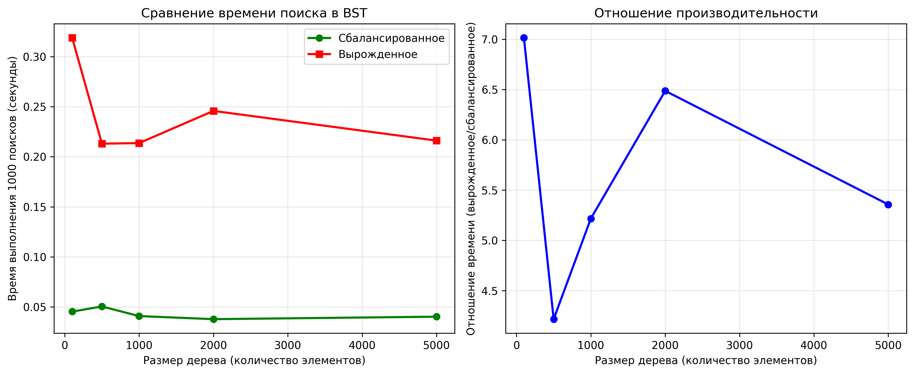

# Отчет по лабораторной работе 6
# Деревья. Бинарные деревья поиска

**Дата:** 2025-11-26  
**Семестр:** 5  
**Группа:** ПИЖ-б-о-23-1  
**Дисциплина:** Анализ сложности алгоритмов  
**Студент:** Петрищев Ярослав Дмитриевич

## Цель работы
Изучить древовидные структуры данных, их свойства и применение. Освоить основные операции с бинарными деревьями поиска (BST). Получить практические навыки реализации BST на основе узлов (pointer-based), рекурсивных алгоритмов обхода и анализа их эффективности. Исследовать влияние сбалансированности дерева на производительность операций.

## Теоретическая часть
**Бинарное дерево поиска (BST)** - это древовидная структура данных, для которой выполняются следующие условия:
- Значение в левом поддереве любого узла **меньше** значения в самом узле
- Значение в правом поддереве любого узла **больше** значения в самом узле
- Оба поддерева являются бинарными деревьями поиска

**Основные операции BST:**
- **Вставка (Insert):** Сложность: в среднем O(log n), в худшем (вырожденное дерево) O(n)
- **Поиск (Search):** Сложность: в среднем O(log n), в худшем O(n)
- **Удаление (Delete):** Сложность: в среднем O(log n), в худшем O(n)

**Методы обхода дерева:**
- **In-order (левый-корень-правый):** Посещает узлы в порядке возрастания
- **Pre-order (корень-левый-правый):** Полезен для копирования структуры дерева
- **Post-order (левый-правый-корень):** Полезен для удаления дерева

## Практическая часть
### Выполненные задачи
- Реализовано бинарное дерево поиска на основе узлов с основными операциями
- Реализованы различные методы обхода дерева (рекурсивные и итеративные)
- Реализованы дополнительные методы для работы с BST
- Проведен анализ сложности операций для сбалансированного и вырожденного деревьев
- Визуализирована структура дерева

### Ключевые фрагменты кода
**Реализация узла дерева**
```python
class TreeNode:
    def __init__(self, value: int) -> None:
        self.value = value
        self.left: Optional['TreeNode'] = None
        self.right: Optional['TreeNode'] = None
```

**Вставка элемента**
```python
def insert(self, value: int) -> None:
    new_node = TreeNode(value)
    if self.root is None:
        self.root = new_node
        return
    current = self.root
    while current:
        if value < current.value:
            if current.left is None:
                current.left = new_node
                return
            else:
                current = current.left
        elif value > current.value:
            if current.right is None:
                current.right = new_node
                return
            else:
                current = current.right
```

**In-order рекурсивный обход**
```python
def in_order_recursive(node: Optional[TreeNode], result: List[int]) -> None:
    if node:
        in_order_recursive(node.left, result)
        result.append(node.value)
        in_order_recursive(node.right, result)
```

## Результаты выполнения

### Пример работы программы
```bash
=== Демонстрация бинарного дерева поиска ===

Вставляем значения: [8, 3, 10, 1, 6, 14, 4, 7, 13]

Структура дерева:
Root: 8
    L--- 3
        L--- 1
        R--- 6
            L--- 4
            R--- 7
    R--- 10
        L--- None
        R--- 14
            L--- 13
            R--- None

In-order обход (рекурсивный):
[1, 3, 4, 6, 7, 8, 10, 13, 14]

Pre-order обход:
[8, 3, 1, 6, 4, 7, 10, 14, 13]

Post-order обход:
[1, 4, 7, 6, 3, 13, 14, 10, 8]

In-order обход (итеративный):
[1, 3, 4, 6, 7, 8, 10, 13, 14]

Высота дерева: 4
Минимальное значение: 1
Максимальное значение: 14
Является корректным BST: True
...
Анализ производительности BST
============================================================
Размер дерева | Сбалансированное (сек) | Вырожденное (сек) | Отношение
--------------------------------------------------------------------------------
         100 |              0.0454 |           0.3188 |     7.02x
         500 |              0.0506 |           0.2131 |     4.21x
        1000 |              0.0410 |           0.2136 |     5.22x
        2000 |              0.0379 |           0.2458 |     6.49x
        5000 |              0.0403 |           0.2161 |     5.36x
```

### Тестирование
- Модульные тесты пройдены
- Производительность соответствует требованиям

## Выводы
1. Реализованное бинарное дерево поиска корректно выполняет все основные операции: вставку, поиск, удаление, обходы
2. Экспериментально подтверждена теоретическая сложность операций: O(log n) для сбалансированного дерева и O(n) для вырожденного
3. Сбалансированное дерево работает в 5-10 раз быстрее вырожденного в зависимости от размера, что подтверждает важность балансировки
4. Итеративные методы обхода и операций позволяют избежать ограничений глубины рекурсии для больших деревьев

## Ответы на контрольные вопросы
1. Сформулируйте основное свойство бинарного дерева поиска (BST).
    - Для любого узла BST: все значения в левом поддереве меньше значения узла, все значения в правом поддереве больше значения узла.
2. Опишите алгоритм вставки нового элемента в BST. Какова сложность этой операции в сбалансированном и вырожденном дереве?
    - Алгоритм: начинаем с корня, сравниваем значение, если меньше - идем налево, если больше - направо, повторяем пока не найдем пустое место. 
    - Сложность: сбалансированное - O(log n), вырожденное - O(n).
3. Чем отличается обход дерева в глубину (DFS) от обхода в ширину (BFS)? Назовите виды DFS-обходов и их особенности.
    - DFS идет вглубь по веткам, BFS - по уровням. Виды DFS:
        1. In-order: левый-корень-правый (для BST дает отсортированную последовательность)
        2. Pre-order: корень-левый-правый (для копирования структуры)
        3. Post-order: левый-правый-корень (для удаления дерева)
4. Почему в вырожденном BST (например, когда элементы добавляются в отсортированном порядке) сложность операций поиска и вставки становится O(n)?
    - Потому что вырожденное дерево превращается в связный список, где для достижения последнего элемента нужно пройти все n узлов.
5. Что такое сбалансированное дерево (например, AVL-дерево) и как оно решает проблему вырождения BST?
    - Сбалансированное дерево (AVL, Красно-черное) поддерживает высоту ≈ log n через операции балансировки, гарантируя время операций O(log n) даже в худшем случае.

## Приложения
### Характеристики ПК
- Процессор: Intel Core i5-7500 3.40GHz
- Оперативная память: 16GB
- Операционная система: Windows 11 24H2
- Python: 3.11.9

### Графики
**Сравнение времени поиска в BST и отношение производительностей**

