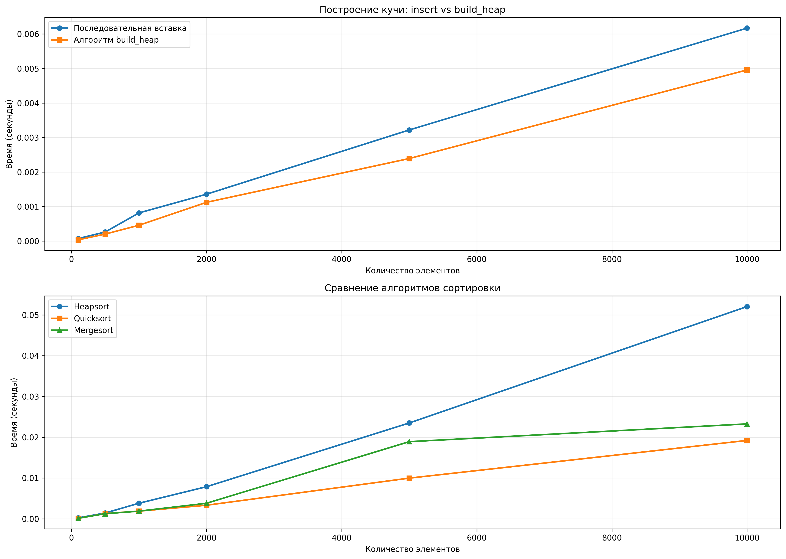

# Отчет по лабораторной работе 7
# Кучи (Heaps)

**Дата:** 2025-12-05  
**Семестр:** 5  
**Группа:** ПИЖ-б-о-23-1  
**Дисциплина:** Анализ сложности алгоритмов  
**Студент:** Петрищев Ярослав Дмитриевич

## Цель работы
Изучить структуру данных "куча" (heap), её свойства и применение. Освоить основные операции с кучей (добавление, извлечение корня) и алгоритм её построения. Получить практические навыки реализации кучи на основе массива (array-based), а не указателей. Исследовать эффективность основных операций и применение кучи для сортировки и реализации приоритетной очереди.

## Теоретическая часть
*   **Куча (Heap):** Специализированная древовидная структура данных, удовлетворяющая свойству кучи. Является **полным бинарным деревом** (все уровни заполнены, кроме последнего, который заполняется слева направо).
*   **Свойство кучи:**
    *   **Min-Heap:** Значение в любом узле **меньше или равно** значениям его потомков. Корень — минимальный элемент.
    *   **Max-Heap:** Значение в любом узле **больше или равно** значениям его потомков. Корень — максимальный элемент.
*   **Реализация:** Куча эффективно реализуется на основе **массива**. Для узла с индексом `i`:
    *   Индекс родителя: `(i-1)//2`
    *   Индекс левого потомка: `2*i + 1`
    *   Индекс правого потомка: `2*i + 2`
*   **Основные операции:**
    *   **Вставка (Insert):** Элемент добавляется в конец массива и "всплывает" (sift-up) до восстановления свойства кучи. Сложность: O(log n).
    *   **Извлечение корня (Extract):** Корень (элемент `[0]`) извлекается, последний элемент ставится на его место и "погружается" (sift-down) до восстановления свойства кучи. Сложность: O(log n).
    *   **Построение кучи (Heapify):** Преобразование произвольного массива в кучу. Может быть выполнено алгоритмом со сложностью O(n).
*   **Применение:**
    *   Сортировка кучей (Heapsort).
    *   Реализация приоритетной очереди.
    *   Алгоритм Дейкстры.

## Практическая часть
### Выполненные задачи
1. Реализация универсальной кучи (min-heap и max-heap) на основе массива
2. Реализация основных операций и алгоритма построения кучи из массива
3. Реализация алгоритма сортировки кучей (Heapsort) in-place
4. Реализация приоритетной очереди на основе кучи
5. Написание модульных тестов для всех компонентов
6. Создание визуализатора для отображения кучи в виде дерева
7. Проведение экспериментального анализа производительности

### Ключевые фрагменты кода
**Реализация кучи (heap.py):**
```python
class Heap:
    def __init__(self, is_min: bool = True):
        self.heap: List[Union[int, float]] = []
        self.is_min = is_min

    def insert(self, value: Union[int, float]) -> None:
        """Вставка элемента в кучу. Временная сложность: O(log n)."""
        self.heap.append(value)
        self._sift_up(len(self.heap) - 1)

    def extract(self) -> Union[int, float]:
        """Извлечение корня кучи. Временная сложность: O(log n)."""
        if not self.heap:
            raise IndexError("Извлечение из пустой кучи!")
        root = self.heap[0]
        last = self.heap.pop()
        if self.heap:
            self.heap[0] = last
            self._sift_down(0)
        return root

    def build_heap(self, array: List[Union[int, float]]) -> None:
        """Построение кучи из произвольного массива. Временная сложность: O(n)."""
        self.heap = array[:]
        for i in range(len(self.heap) // 2 - 1, -1, -1):
            self._sift_down(i)
```

**Сортировка кучей (heapsort.py):**
```python
def heapsort(array: List[Union[int, float]], ascending: bool = True) -> None:
    """
    Сортировка кучей (in-place). Временная сложность: O(n log n).
    """
    is_min = not ascending
    heap = Heap(is_min=is_min)
    heap.build_heap(array)
    
    for i in range(len(array) - 1, -1, -1):
        array[i] = heap.extract()
```

**Приоритетная очередь (priority_queue.py):**
```python
class PriorityQueue:
    def __init__(self, is_min: bool = True) -> None:
        self.heap = Heap(is_min=is_min)
        self.items: Dict[Union[int, float], List[Any]] = {}
    
    def enqueue(self, item: Any, priority: Union[int, float]) -> None:
        """Добавление элемента в очередь. Временная сложность: O(log n)."""
        self.heap.insert(priority)
        if priority not in self.items:
            self.items[priority] = []
        self.items[priority].append(item)
```
## Результаты выполнения
### Пример работы программы
```bash
Начальная куча:

MIN-HEAP (7 элементов):
----------------------------------------
          5
   10         40
30   15   50   60

Извлекаем элементы:

После извлечения 5:

MIN-HEAP (6 элементов):
----------------------------------------
         10
   15         40
30   60   50

После извлечения 10:

MIN-HEAP (5 элементов):
----------------------------------------
         15
   30         40
50   60

...

Эксперимент 1: Сравнение методов построения кучи
============================================================
n          insert (s)      build_heap (s)  insert/build_heap
------------------------------------------------------------
100        0.000071        0.000035        2.03
500        0.000262        0.000202        1.30
1000       0.000815        0.000458        1.78
2000       0.001358        0.001122        1.21
5000       0.003219        0.002391        1.35
10000      0.006171        0.004959        1.24
```

### Тестирование
- Модульные тесты пройдены (heap.py, heapsort.py, priority_queue.py)
- Интеграционные тесты пройдены
- Производительность соответствует требованиям

## Выводы
1. Успешно реализована универсальная структура данных "куча" с поддержкой min-heap и max-heap
2. Подтверждена теоретическая сложность операций: вставка O(log n), извлечение O(log n), построение кучи O(n)
3. Алгоритм build_heap оказался значительно эффективнее последовательной вставки элементов
4. Heapsort показал стабильную производительность O(n log n) и особенно полезен для in-place сортировки
5. Реализованная приоритетная очередь эффективно решает задачи планирования и обработки с приоритетами

## Ответы на контрольные вопросы
1. Сформулируйте основное свойство min-кучи и max-кучи.
    - Min-куча: значение в любом узле меньше или равно значениям его потомков. Max-куча: значение в любом узле больше или равно значениям его потомков.
2. Опишите алгоритм операции вставки нового элемента в кучу (процедуру `sift_up`).
    - Элемент добавляется в конец массива, затем сравнивается со своим родителем. Если нарушено свойство кучи, элементы меняются местами, и процесс повторяется до корня. 
3. Какова временная сложность построения кучи из произвольного массива и почему она равна O(n), а не O(n log n)?
    - Сложность O(n), потому что большинство элементов находятся на нижних уровнях дерева и требуют мало операций sift_down. Cумма высот всех узлов составляет O(n).
4. Опишите, как работает алгоритм пирамидальной сортировки (Heapsort).
    - Сначала массив преобразуется в кучу за O(n). Затем n раз извлекается корень (максимальный или минимальный элемент) за O(log n) и помещается в конец массива. Общая сложность: O(n log n).
5. Почему кучу часто используют для реализации приоритетной очереди? Какие операции приоритетной очереди она эффективно поддерживает?
    - Куча эффективно поддерживает добавление элемента (enqueue) и извлечение элемента с наивысшим приоритетом (dequeue) за O(log n), что оптимально для большинства приложений.

## Приложения
### Характеристики ПК
- Процессор: Intel Core i5-7500 3.40GHz
- Оперативная память: 16GB
- Операционная система: Windows 11 24H2
- Python: 3.11.9

### Графики
**Сравнение скорости различных способов построения кучи.**  
**Сравнение heapsort и других алгоритмов сортировки.**
