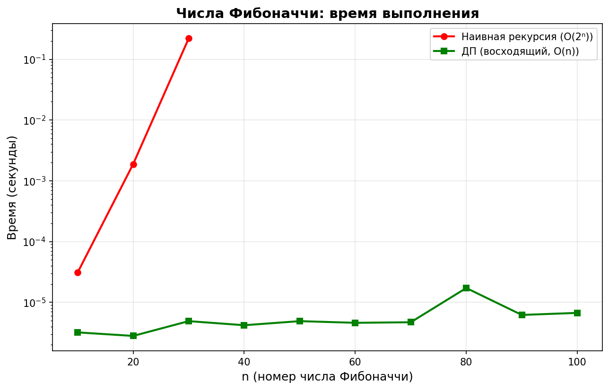
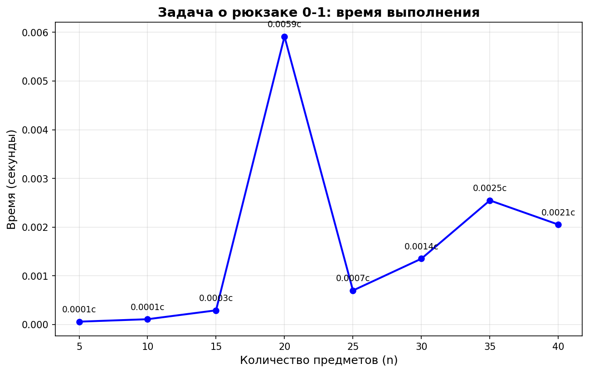
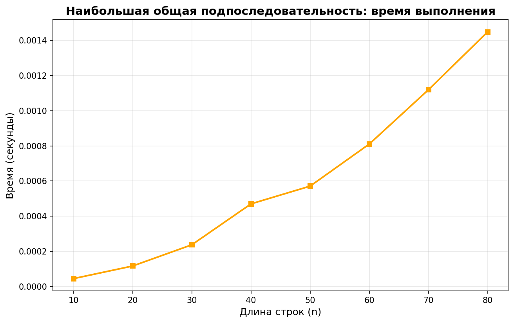
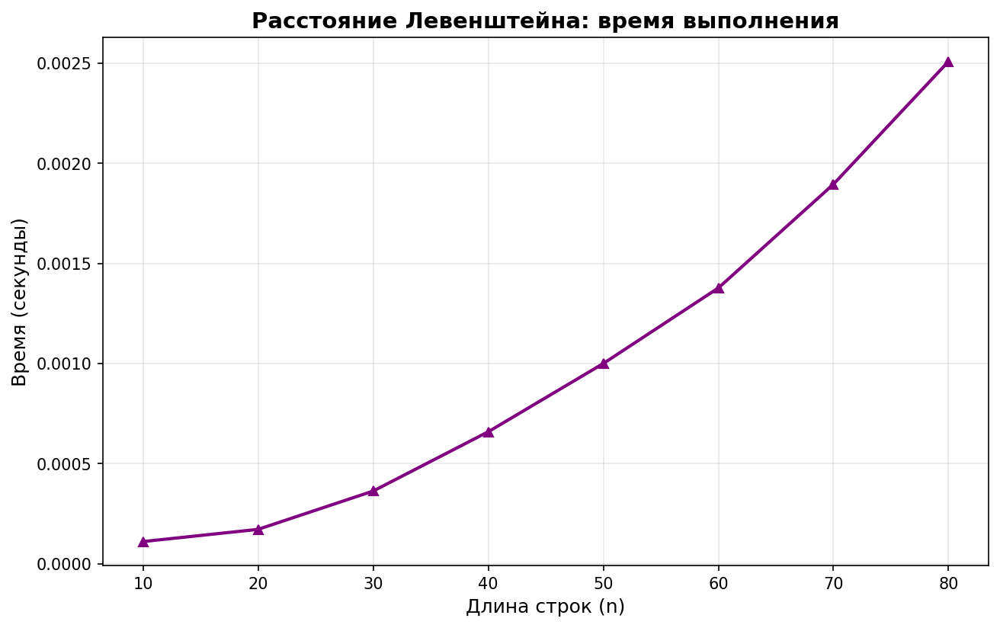
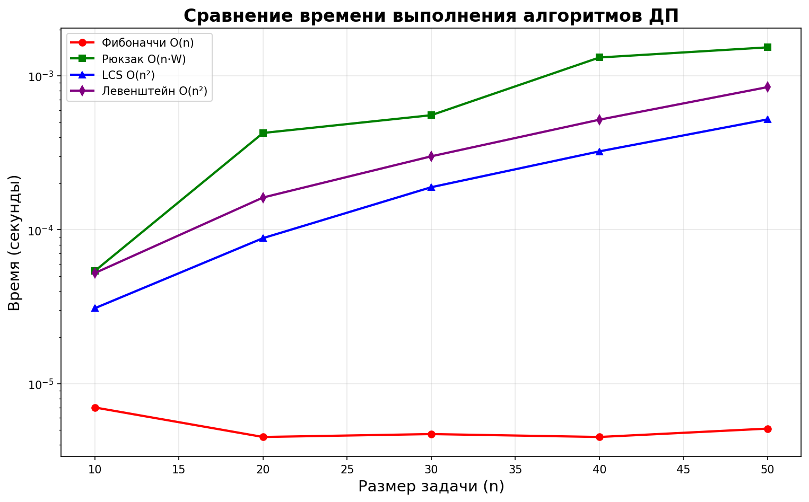

# Отчет по лабораторной работе 9
# Динамическое программирование

**Дата:** 2025-12-07  
**Семестр:** 5  
**Группа:** ПИЖ-б-о-23-1  
**Дисциплина:** Анализ сложности алгоритмов  
**Студент:** Петрищев Ярослав Дмитриевич

## Цель работы
Изучить метод динамического программирования (ДП) как мощный инструмент для решения сложных задач путём их разбиения на перекрывающиеся подзадачи. Освоить два основных подхода к реализации ДП: нисходящий (с мемоизацией) и восходящий (с заполнением таблицы). Получить практические навыки выявления оптимальной подструктуры задач, построения таблиц ДП и анализа временной и пространственной сложности алгоритмов.

## Теоретическая часть
*   **Динамическое программирование (ДП):** Метод решения задач, в которых оптимальное решение всей задачи зависит от оптимальных решений её **перекрывающихся подзадач**.
*   **Ключевые принципы:**
    *   **Оптимальная подструктура:** Оптимальное решение задачи может быть построено из оптимальных решений её подзадач.
    *   **Перекрывающиеся подзадачи:** Подзадачи, решения которых используются многократно, а не один раз.
*   **Подходы к реализации:**
    *   **Нисходящее ДП (Top-Down, с мемоизацией):** Рекурсивное решение с сохранением (кэшированием) результатов решения подзадач для повторных вычислений.
    *   **Восходящее ДП (Bottom-Up, табличное):** Итеративное решение, при котором подзадачи решаются от простейших к сложным, а их результаты заносятся в таблицу (массив).
*   **Области применения:** Задачи оптимизации, подсчёта количества способов, нахождения наиболее вероятной последовательности.
*   **Классические задачи:**
    *   **Числа Фибоначчи:** Классический пример перекрывающихся подзадач.
    *   **Задача о рюкзаке (0-1 Knapsack):** Выбор предметов с максимальной суммарной стоимостью без дробления.
    *   **Наибольшая общая подпоследовательность (LCS):** Поиск самой длинной последовательности символов, которая является подпоследовательностью двух строк.
    *   **Расстояние Левенштейна (Редакционное расстояние):** Минимальное количество операций вставки, удаления и замены символа, необходимых для превращения одной строки в другую.

## Практическая часть
### Выполненные задачи
1. Реализация классических алгоритмов динамического программирования
2. Реализация обоих подходов (нисходящий и восходящий) для решения задач
3. Анализ временной и пространственной сложности алгоритмов
4. Решение практических задач с применением ДП (размен монет, LIS)
5. Реализация восстановления решения для задачи о рюкзаке
6. Исследование масштабируемости алгоритмов ДП
7. Визуализация процесса заполнения таблицы ДП
8. Построение графиков зависимости времени выполнения от размера задачи

### Ключевые фрагменты кода
**Восходящий подход для задачи о рюкзаке 0-1:**
```python
def bottom_up(weights: list, values: list, capacity: int) -> tuple:
    n = len(weights)
    dp = [[0] * (capacity + 1) for _ in range(n + 1)]
    
    for i in range(1, n + 1):
        for w in range(1, capacity + 1):
            if weights[i-1] <= w:
                dp[i][w] = max(dp[i-1][w], 
                              dp[i-1][w - weights[i-1]] + values[i-1])
            else:
                dp[i][w] = dp[i-1][w]
    
    # Восстановление решения
    selected_items = []
    w = capacity
    for i in range(n, 0, -1):
        if dp[i][w] != dp[i-1][w]:
            selected_items.append(i-1)
            w -= weights[i-1]
    
    selected_items.reverse()
    return dp[n][capacity], selected_items
```

**Нахождение наибольшей общей подпоследовательности:**
```python
def bottom_up(str1: str, str2: str) -> tuple:
    m, n = len(str1), len(str2)
    dp = [[0] * (n + 1) for _ in range(m + 1)]
    
    for i in range(1, m + 1):
        for j in range(1, n + 1):
            if str1[i-1] == str2[j-1]:
                dp[i][j] = dp[i-1][j-1] + 1
            else:
                dp[i][j] = max(dp[i-1][j], dp[i][j-1])
    
    # Восстановление подпоследовательности
    lcs_chars = []
    i, j = m, n
    while i > 0 and j > 0:
        if str1[i-1] == str2[j-1]:
            lcs_chars.append(str1[i-1])
            i -= 1
            j -= 1
        elif dp[i-1][j] > dp[i][j-1]:
            i -= 1
        else:
            j -= 1
    
    lcs_chars.reverse()
    lcs_string = ''.join(lcs_chars)
    
    return dp[m][n], lcs_string
```

## Результаты выполнения
### Пример работы программы
```bash
1. ЧИСЛА ФИБОНАЧЧИ
F(10) =
  Наивная рекурсия: 55
  С мемоизацией: 55
  Восходящий подход: 55

2. ЗАДАЧА О РЮКЗАКЕ 0-1
Веса: [2, 3, 4, 5], Стоимости: [3, 4, 5, 6], Вместимость: 5
Максимальная стоимость: 7
Выбранные предметы (индексы): [0, 1]

3. НАИБОЛЬШАЯ ОБЩАЯ ПОДПОСЛЕДОВАТЕЛЬНОСТЬ
Строка 1: ABCBDAB
Строка 2: BDCABA
Длина LCS: 4
LCS: BDAB

...

Для n = 5:
  Наивная рекурсия: 5 (время: 0.000003 сек)
  Мемоизация: 5 (время: 0.000002 сек)
  Восходящий подход: 5 (время: 0.000004 сек)

Для n = 10:
  Наивная рекурсия: 55 (время: 0.000017 сек)
  Мемоизация: 55 (время: 0.000001 сек)
  Восходящий подход: 55 (время: 0.000003 сек)

...

Начальная таблица (все нули):
  w |   0   1   2   3   4   5
 ---+------------------------
 i=0|   0   0   0   0   0   0
 i=1|   0   0   0   0   0   0
 i=2|   0   0   0   0   0   0
 i=3|   0   0   0   0   0   0


--- Шаг 1: рассматриваем предмет 0 (вес=2, стоимость=3) ---

  Для вместимости w=1:
    Предмет не помещается (2 > 1)
    Берем dp[0][1] = 0

...
```

## Выводы
1. Эффективность ДП: Динамическое программирование позволяет ускорить решение задач с перекрывающимися подзадачами в десятки тысяч раз. Для вычисления F(30) наивная рекурсия заняла 0.224 секунды, а ДП-подходы — менее 0.00002 секунды.
2. Сравнение подходов: Нисходящий (с мемоизацией) и восходящий (табличный) подходы имеют сравнимую производительность для большинства задач. Восходящий подход обычно быстрее из-за отсутствия накладных расходов на рекурсию.
3. Восстановление решений: Реализованное восстановление решений позволяет получать не только оптимальное значение, но и сам набор элементов/последовательность. Это важно для практических применений алгоритмов.
4. Асимптотическая сложность: Временная сложность реализованных алгоритмов соответствует теоретическим оценкам:
    - Числа Фибоначчи: O(n) для ДП vs O(2ⁿ) для наивной рекурсии
    - Рюкзак 0-1: O(n·W)
    - LCS и Левенштейн: O(m·n) ≈ O(n²)
5. Пространственная оптимизация: Для некоторых задач возможно уменьшение использования памяти. Например, для рюкзака можно использовать одномерный массив вместо двумерного, уменьшив сложность с O(n·W) до O(W).
6. Практическая применимость: Реализованные алгоритмы решают широкий класс практических задач: от финансовой оптимизации (рюкзак) до обработки текстов (Левенштейн).

## Ответы на контрольные вопросы
1. Какие два основных свойства задачи указывают на то, что для ее решения можно применить динамическое программирование?
    - Оптимальная подструктура: оптимальное решение задачи можно построить из оптимальных решений подзадач.
    - Перекрывающиеся подзадачи: подзадачи решаются многократно, а не один раз.
2. В чем разница между нисходящим (top-down) и восходящим (bottom-up) подходами в динамическом программировании?
    - Нисходящий подход (с мемоизацией): начинается с основной задачи и рекурсивно разбивает её на подзадачи, кэшируя результаты.
    - Восходящий подход (табличный): начинается с простейших подзадач и итеративно наращивает решение, заполняя таблицу.
3. Как задача о рюкзаке 0-1 демонстрирует свойство оптимальной подструктуры?
    - Оптимальное решение для рюкзака вместимостью W строится из оптимальных решений для меньших вместимостей. Если мы знаем оптимальное решение для вместимости W-wᵢ, то можем получить решение для W, рассмотрев добавление предмета i.
4. Опишите, как строится и заполняется таблица для решения задачи о наибольшей общей подпоследовательности (LCS).
    1. Создается таблица размером (m+1)×(n+1), где m и n — длины строк. 
    2. dp[i][j] = длина LCS для префиксов str1[0:i] и str2[0:j].
    3. Правила заполнения:
        - Если str1[i-1] == str2[j-1]: dp[i][j] = dp[i-1][j-1] + 1
        - Иначе: dp[i][j] = max(dp[i-1][j], dp[i][j-1])
    4. Ответ находится в dp[m][n].
5. Как с помощью динамического программирования можно уменьшить сложность вычисления чисел Фибоначчи с экспоненциальной до линейной или даже до O(log n)?
    - Линейное решение: восходящий подход с хранением двух последних чисел (O(n) время, O(1) память).
    - Логарифмическое решение: использование матричного возведения в степень. Числа Фибоначчи можно выразить через степень матрицы [[1,1],[1,0]], возведение в степень можно выполнить за O(log n) с помощью бинарного возведения в степень.

## Приложения
### Характеристики ПК
- Процессор: Intel Core i5-7500 3.40GHz
- Оперативная память: 16GB
- Операционная система: Windows 11 24H2
- Python: 3.11.9

### Графики
**Числа Фибоначчи**  


**Задача о рюкзаке 0-1**  


**Наибольшая общая подпоследовательность**  


**Расстояние Левенштейна**  


**Сравнение времени выполнения алгоритмов ДП**  
