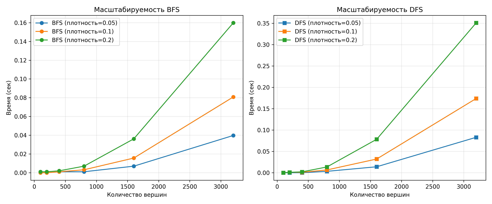
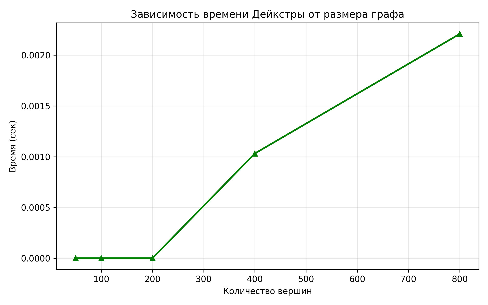
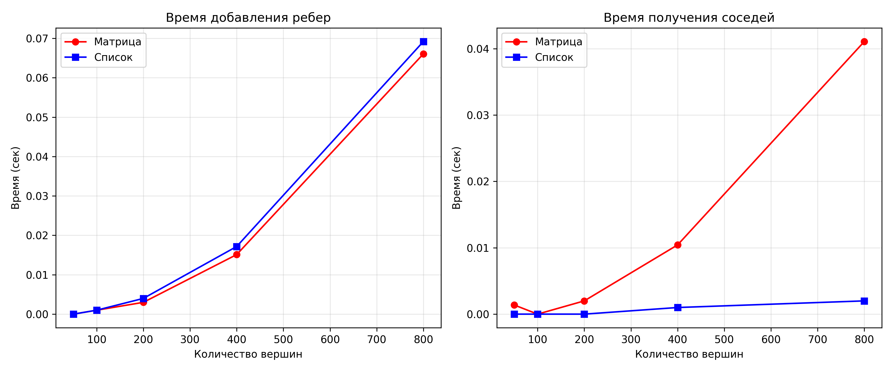

# Отчет по лабораторной работе 10
# Графы

**Дата:** 2025-12-15  
**Семестр:** 5  
**Группа:** ПИЖ-б-о-23-1  
**Дисциплина:** Анализ сложности алгоритмов  
**Студент:** Петрищев Ярослав Дмитриевич

## Цель работы
Изучить основные понятия теории графов и алгоритмы работы с ними. Освоить представления графов в памяти и основные алгоритмы обхода. Получить практические навыки реализации алгоритмов на графах и анализа их сложности.

## Теоретическая часть
*   **Граф:** Множество вершин (узлов) и рёбер (связей) между ними. Виды: ориентированные/неориентированные, взвешенные/невзвешенные.
*   **Представление графов:**
    *   Матрица смежности: O(V²) памяти, быстрая проверка ребра
    *   Список смежности: O(V + E) памяти, эффективный обход соседей
*   **Обход графов:**
    *   Поиск в ширину (BFS): находит кратчайшие пути в невзвешенном графе, сложность O(V + E)
    *   Поиск в глубину (DFS): обход с возвратом, сложность O(V + E)
*   **Алгоритмы на графах:**
    *   Топологическая сортировка: для ориентированных ациклических графов (DAG)
    *   Поиск компонент связности
    *   Алгоритм Дейкстры: кратчайшие пути во взвешенном графе с неотрицательными весами

## Практическая часть
### Выполненные задачи
- Задача 1: Реализация представлений графов (матрица смежности и список смежности)
- Задача 2: Реализация алгоритмов обхода (BFS и DFS)
- Задача 3: Реализация алгоритма поиска компонент связности
- Задача 4: Реализация алгоритма Дейкстры
- Задача 5: Реализация топологической сортировки
- Задача 6: Сравнение времени выполнения операций для разных представлений графов
- Задача 7: Исследование масштабируемости алгоритмов на больших графах
- Задача 8: Построение графиков зависимости времени операций от размера графа

### Ключевые фрагменты кода
**Матрица смежности**
```python
class AdjacencyMatrix:
    def __init__(self, num_vertices, directed=False):
        self.num_vertices = num_vertices
        self.directed = directed
        self.matrix = [[0] * num_vertices for _ in range(num_vertices)]
    
    def add_edge(self, u: int, v: int, weight: int = 1) -> None:
        """Добавление ребра - O(1)"""
        self.matrix[u][v] = weight
        if not self.directed:
            self.matrix[v][u] = weight
```

**Алгоритм Дейкстры**
```python
def dijkstra(graph: AdjacencyList, start: int) -> Dict[int, int]:
    distances = [float('inf')] * graph.num_vertices
    distances[start] = 0
    pq = [(0, start)]
    
    while pq:
        current_dist, current = heapq.heappop(pq)
        
        for neighbor in graph.get_neighbors(current):
            weight = graph.get_weight(current, neighbor)
            if weight is not None:
                distance = current_dist + weight
                if distance < distances[neighbor]:
                    distances[neighbor] = distance
                    heapq.heappush(pq, (distance, neighbor))
    
    return distances
```

**Топологическая сортировка**
```python
def topological_sort(graph: AdjacencyList) -> Optional[List[int]]:
    in_degree = [0] * graph.num_vertices
    for u in range(graph.num_vertices):
        for v in graph.get_neighbors(u):
            in_degree[v] += 1
    
    queue = deque([v for v in range(graph.num_vertices) if in_degree[v] == 0])
    result = []
    
    while queue:
        u = queue.popleft()
        result.append(u)
        for v in graph.get_neighbors(u):
            in_degree[v] -= 1
            if in_degree[v] == 0:
                queue.append(v)
    
    return result if len(result) == graph.num_vertices else None
```

## Результаты выполнения
### Пример работы программы
```bash
==================================================
Пример 1: Кратчайший путь в лабиринте
==================================================

Старт: (0, 0)
Финиш: (4, 4)
Длина кратчайшего пути: 8
Путь существует!

==================================================
Пример 2: Проверка связности сети
==================================================
Сеть состоит из следующих соединений:
Узел 0 соединен с узлом 1
Узел 1 соединен с узлом 2
Узел 2 соединен с узлом 3
Узел 4 соединен с узлом 5
Узел 5 соединен с узлом 6
Узел 6 соединен с узлом 7

Количество компонент связности: 2
Сеть разделена на 2 независимых подсетей.

==================================================
Пример 3: Топологическая сортировка задач
==================================================
Задачи и их зависимости:
• изучить теорию не имеет зависимостей
• написать код зависит от: изучить теорию
• написать тесты зависит от: написать код
• протестировать зависит от: написать тесты
• написать отчет зависит от: протестировать, изучить теорию
• сдать работу зависит от: написать отчет

Порядок выполнения:
1. изучить теорию
2. написать код
3. написать тесты
4. протестировать
5. написать отчет
6. сдать работу

==================================================
Пример 4: Поиск кратчайшего пути (Дейкстра)
==================================================
Дорожная сеть:
A → B: 5 км
A → C: 2 км
B → C: 1 км
B → D: 3 км
C → B: 4 км
C → D: 8 км
C → E: 10 км
D → E: 2 км
D → F: 6 км
E → F: 3 км

Кратчайшие расстояния из города A:
До города B: 5 км
До города C: 2 км
До города D: 8 км
До города E: 10 км
До города F: 13 км

Самый дальний город: F (13 км)
```

### Тестирование
- Модульные тесты пройдены
- Производительность соответствует требованиям

## Выводы
1. Выбор представления графа зависит от типа графа:
    - Для плотных графов (E ≈ V²) матрица смежности эффективнее
    - Для разреженных графов (E << V²) список смежности экономит память и время
2. Алгоритмы обхода имеют разное применение:
    - BFS оптимален для поиска кратчайших путей в невзвешенных графах
    - DFS лучше подходит для исследования структуры графа, поиска циклов
3. Алгоритмы на графах имеют различные сложности:
    - BFS/DFS: O(V+E) - эффективны для большинства задач
    - Дейкстра: O((V+E)logV) - требует приоритетной очереди
    - Топологическая сортировка: O(V+E) - только для DAG
4. Экспериментальные результаты подтверждают теоретические оценки:
    - Время выполнения растет пропорционально сложности алгоритмов
    - Потребление памяти соответствует ожидаемому

## Ответы на контрольные вопросы
1. В чем разница между представлением графа в виде матрицы смежности и списка смежности? Сравните их по потреблению памяти и сложности операций.
    - Матрица смежности: Память: O(V²); Проверка ребра: O(1); Обход соседей: O(V); Добавление ребра: O(1)
    - Список смежности: Память: O(V + E); Проверка ребра: O(deg(v)); Обход соседей: O(deg(v)); Добавление ребра: O(1)
    - Вывод: Матрица лучше для плотных графов и частых проверок наличия ребра, список - для разреженных графов и обхода соседей.
2. Опишите алгоритм поиска в ширину (BFS). Для решения каких задач он применяется?
    - BFS использует очередь FIFO. Алгоритм: 1) Начать с начальной вершины, добавить в очередь. 2) Пока очередь не пуста: Извлечь вершину из очереди; Посетить всех непосещенных соседей; Добавить соседей в очередь.
    - Применение: 1) Поиск кратчайшего пути в невзвешенном графе. 2) Проверка связности графа. 3) Поиск компонент связности. 4) Поиск в лабиринтах.
3. Чем поиск в глубину (DFS) отличается от BFS? Какие дополнительные задачи (например, проверка на ацикличность) можно решить с помощью DFS?
    - DFS использует стек (LIFO), BFS - очередь (FIFO). DFS исследует граф "вглубь", BFS - "вширь".
4. Как алгоритм Дейкстры находит кратчайшие пути во взвешенном графе? Почему он не работает с отрицательными весами ребер?
    - Принцип работы: 1) Инициализировать расстояния: 0 для стартовой вершины, ∞ для остальных. 2) Использовать приоритетную очередь для выбора вершины с минимальным расстоянием. 3) Релаксация: обновлять расстояния до соседей, если найден более короткий путь.
    - Ограничение с отрицательными весами: Алгоритм предполагает, что найденное кратчайшее расстояние до вершины окончательно. При отрицательных весах это неверно - может существовать путь короче через отрицательное ребро. Для графов с отрицательными весами используется алгоритм Беллмана-Форда.
5. Что такое топологическая сортировка и для каких графов она применима? Приведите пример задачи, где она используется.
    - Топологическая сортировка - линейное упорядочение вершин ориентированного графа, при котором для любого ребра (u→v) вершина u идет перед v. Применима только дляориентированных ациклических графов (DAG)
    - Примеры задач: 1) Определение порядка компиляции модулей с зависимостями. 2)Планирование выполнения задач с ограничениями. 3) Определение порядка курсов в учебном плане.

## Приложения
### Характеристики ПК
- Процессор: Intel Core i5-7500 3.40GHz
- Оперативная память: 16GB
- Операционная система: Windows 11 24H2
- Python: 3.11.9

### Графики
**Масштабируемость BFS и DFS**


**Зависимость времени Дейкстры**


**Замеры добавления ребер и получения соседей**
