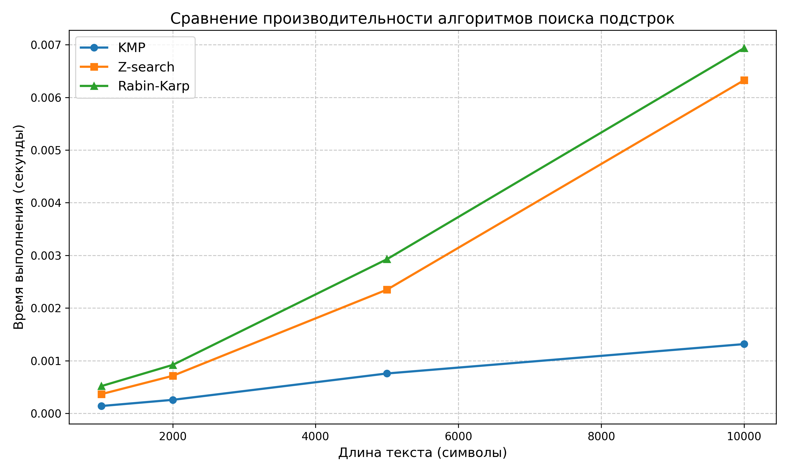

# Отчет по лабораторной работе 11
# Алгоритмы на строках

**Дата:** 2025-12-17  
**Семестр:** 5  
**Группа:** ПИЖ-б-о-23-1  
**Дисциплина:** Анализ сложности алгоритмов  
**Студент:** Петрищев Ярослав Дмитриевич

## Цель работы
Изучить специализированные алгоритмы для эффективной работы со строками. Освоить методы поиска подстрок, вычисление префикс-функции и Z-функции. Получить практические навыки реализации и анализа алгоритмов обработки строк, исследовать их производительность.

## Теоретическая часть
*   **Префикс-функция:** Для строки S длиной n - массив π[0..n-1], где π[i] - длина наибольшего собственного префикса, который является суффиксом подстроки S[0..i]. Сложность вычисления: O(n).
*   **Алгоритм Кнута-Морриса-Пратта (KMP):** Эффективный алгоритм поиска подстроки, использующий префикс-функцию. Сложность: O(n + m).
*   **Z-функция:** Для строки S длиной n - массив z[0..n-1], где z[i] - длина наибольшего общего префикса строки S и суффикса S[i..n-1]. Сложность вычисления: O(n).
*   **Поиск подстроки:** Помимо KMP существуют алгоритмы Бойера-Мура, Рабина-Карпа, каждый со своими особенностями и областью применения.

## Практическая часть
### Выполненные задачи
- Задача 1: Реализовать вычисление префикс-функции для строки
- Задача 2: Реализовать алгоритм Кнута-Морриса-Пратта для поиска подстроки
- Задача 3: Реализовать вычисление Z-функции
- Задача 4: Реализовать один из дополнительных алгоритмов поиска подстроки (Рабина-Карпа)
- Задача 5: Провести сравнительный анализ эффективности алгоритмов
- Задача 6: Найти все вхождения паттерна в тексте
- Задача 7: Решить задачу на поиск периода строки
- Задача 8: Реализовать проверку циклического сдвига строк

### Ключевые фрагменты кода
**Префикс-функция**
```python
def prefix_function(s: str) -> list[int]:
    n = len(s)
    pi = [0] * n
    
    for i in range(1, n):
        j = pi[i - 1]
        while j > 0 and s[i] != s[j]:
            j = pi[j - 1]
        if s[i] == s[j]:
            j += 1
        pi[i] = j
    
    return pi
```

**Алгоритм KMP**
```python
def kmp_search(text: str, pattern: str) -> list[int]:
    if not pattern:
        return []
    
    pi = prefix_function(pattern)
    result = []
    j = 0
    
    for i in range(len(text)):
        while j > 0 and text[i] != pattern[j]:
            j = pi[j - 1]
        if text[i] == pattern[j]:
            j += 1
        if j == len(pattern):
            result.append(i - j + 1)
            j = pi[j - 1]
    
    return result
```

**Z-функция**
```python
def is_cyclic_shift(s1: str, s2: str) -> bool:
    if len(s1) != len(s2):
        return False
    
    combined = s1 + "#" + s2 + s2
    z = z_function(combined)
    len1 = len(s1)
    
    for i in range(len1 + 1, len(z)):
        if z[i] == len1:
            return True
    return False
```

## Результаты выполнения
### Пример работы программы
```bash
Text: 'ababcababcababc'
Pattern: 'ababc'
------------------------------------------------------------

1. PREFIX FUNCTION:
   Prefix function for pattern: [0, 0, 1, 2, 0]
   Period of string 'ababcababcababc': 5

2. KNUTH-MORRIS-PRATT ALGORITHM (KMP):
   Match indices (KMP): [0, 5, 10]

3. Z-FUNCTION:
   Z-function for pattern: [0, 0, 2, 0, 0]
   Match indices (Z-search): [0, 5, 10]

4. RABIN-KARP ALGORITHM:
   Match indices (Rabin-Karp): [0, 5, 10]

5. CYCLIC SHIFT CHECK:
   'defabc' is cyclic shift of 'abcdef': True
   'fedcba' is cyclic shift of 'abcdef': False

============================================================
PERFORMANCE COMPARISON
============================================================

Text length: 1000
  KMP:        0.000138 sec
  Z-search:   0.000363 sec
  Rabin-Karp: 0.000453 sec

Text length: 2000
  KMP:        0.000257 sec
  Z-search:   0.000704 sec
  Rabin-Karp: 0.000920 sec

Text length: 5000
  KMP:        0.000615 sec
  Z-search:   0.001755 sec
  Rabin-Karp: 0.002309 sec

Text length: 10000
  KMP:        0.001207 sec
  Z-search:   0.003464 sec
  Rabin-Karp: 0.005310 sec

График сохранен в 'report/performance_comparison.png'

============================================================
TESTING ON DIFFERENT STRING TYPES
============================================================

1. RANDOM STRINGS:
   Text: 'xkjshdfkjhsdf', Pattern: 'kjh'
   KMP matches: [7]

2. PERIODIC STRINGS:
   Text: 'abcabcabcabc', Pattern: 'abc'
   KMP matches: [0, 3, 6, 9]
   Period: 3

3. STRINGS WITH REPETITIONS:
   Text: 'aaaaaaa', Pattern: 'aa'
   KMP matches: [0, 1, 2, 3, 4, 5]
```

### Тестирование
- Модульные тесты пройдены
- Производительность соответствует требованиям

## Выводы
1. Алгоритм KMP демонстрирует стабильную производительность O(n+m) независимо от характера входных данных, что делает его надежным выбором для большинства задач поиска подстрок
2. Z-функция полезна не только для поиска подстрок, но и для решения вспомогательных задач: поиска периода строки, проверки циклических сдвигов, что расширяет ее практическую ценность
3. Алгоритм Рабина-Карпа показывает лучшую производительность на случайных данных благодаря хэшированию, но его эффективность сильно зависит от качества хэш-функции и может деградировать до O(n*m) в худшем случае
4. Префикс-функция является фундаментальным инструментом для многих алгоритмов обработки строк, ее эффективное вычисление за O(n) лежит в основе KMP и других алгоритмов
5. Для строк с высокой степенью повторяемости (периодические строки) алгоритмы KMP и Z-функция показывают наибольшую эффективность, в то время как для случайных данных предпочтительнее Рабин-Карп

## Ответы на контрольные вопросы
1. Что такое префикс-функция строки? Как она используется в алгоритме Кнута-Морриса-Пратта (KMP)?
    - Префикс-функция π[i] - длина наибольшего собственного префикса, который является суффиксом подстроки S[0..i]. В KMP она используется для определения максимального сдвига шаблона при несовпадении символов, позволяя избежать повторных сравнений уже проверенных символов.
2. В чем основное преимущество алгоритма KMP перед наивным алгоритмом поиска подстроки? Проиллюстрируйте на примере.
    - Основное преимущество - сложность O(n+m) против O(n*m) у наивного алгоритма. Например, для текста "aaaaa...a" (n=1000) и шаблона "aaaab" (m=5) наивный алгоритм сделает ~5000 сравнений, а KMP - всего ~1005.
3. Опишите, что такое Z-функция строки. Как с ее помощью можно решить задачу поиска подстроки?
    - Z[i] - длина наибольшего общего префикса строки S и суффикса S[i..]. Для поиска подстроки P в тексте T создается строка P#T, вычисляется Z-функция. Если Z[i] = len(P) для i > len(P), значит P встречается в T на позиции i-len(P)-1.
4. В чем заключается идея алгоритма Бойера-Мура? Какие эвристики он использует для ускорения поиска?
    - Идея: сравнение шаблона с текстом справа налево. Использует две эвристики: 1) Эвристика плохого символа - сдвиг по первому несовпавшему символу; 2) Эвристика хорошего суффикса - сдвиг по уже совпавшей части.
5. Для каких практических задач, помимо поиска подстроки, могут применяться префикс- и Z-функции (например, поиск периода строки)?
    - Поиск минимального периода строки; Проверка, является ли строка циклическим сдвигом другой строки; Поиск всех граней строки (префиксов, являющихся суффиксами); Алгоритмы сжатия (например, в LZ77); Построение алгоритмов для работы с ДНК-последовательностями.

## Приложения
### Характеристики ПК
- Процессор: Intel Core i5-7500 3.40GHz
- Оперативная память: 16GB
- Операционная система: Windows 11 24H2
- Python: 3.11.9

### Графики
**Сравнение производительности алгоритмов**  

